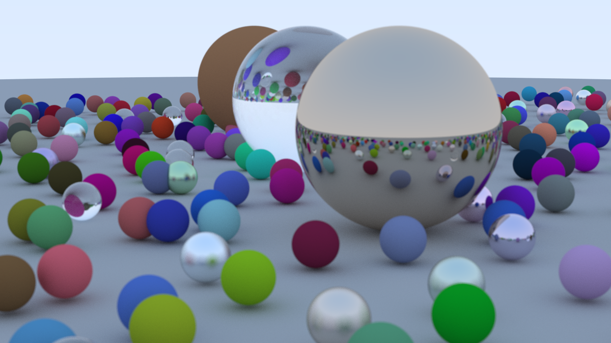

# Ray Tracer

Implementation of a ray tracer based on the book [Ray Tracing in One Weekend](https://raytracing.github.io/books/RayTracingInOneWeekend.html). The code is built using C++20 and can be compiled most compilers such as g++, Clang or Microsoft Visual Studio.

## Running the project
```
    1. Clone the repository: git clone https://github.com/zhoyx/Ray-Tracing.git
    2. cd Ray-Tracing
    3. Compiling the source code: g++ main.cpp -o raytracer
    4. Running the code: ./raytracer > image.ppm
    5. Open the generated image.ppm file with any ppm image viewers
```

